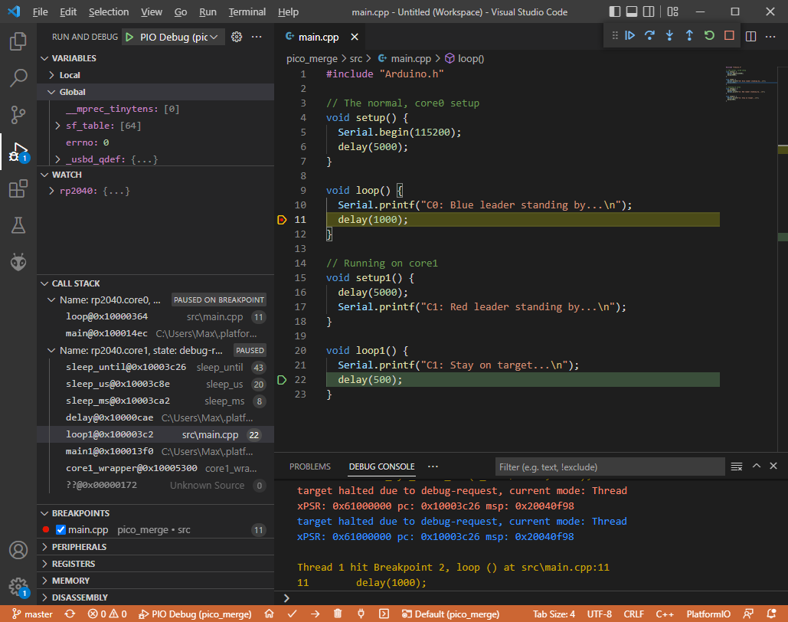
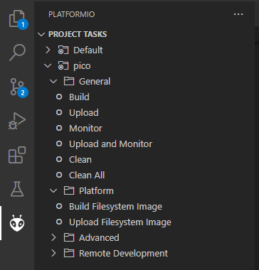

Using this core with PlatformIO
===============================

What is PlatformIO?
-------------------

`PlatformIO <https://platformio.org/>`__  is a free, open-source build-tool written in Python, which also integrates into VSCode code as an extension.

PlatformIO significantly simplifies writing embedded software by offering a unified build system, yet being able to create project files for many different IDEs, including VSCode, Eclipse, CLion, etc.
Through this, PlatformIO can offer extensive features such as IntelliSense (autocomplete), debugging, unit testing etc., which not available in the standard Arduino IDE.

The Arduino IDE experience:

.. image:: images/the_arduinoide_experience.png

The PlatformIO experience:

.. image:: images/the_platformio_experience.png

Refer to the general documentation at https://docs.platformio.org/.

Especially useful is the `Getting started with VSCode + PlatformIO <https://docs.platformio.org/en/latest/integration/ide/vscode.html#installation>`_, `CLI reference <https://docs.platformio.org/en/latest/core/index.html>`_ and the `platformio.ini options <https://docs.platformio.org/en/latest/projectconf/index.html>`_ page.

Hereafter it is assumed that you have a basic understanding of PlatformIO in regards to project creation, project file structure and building and uploading PlatformIO projects, through reading the above pages.

Important steps for Windows users, before installing
----------------------------------------------------

By default, Windows has a limited path length that is not long enough to fully clone the ``Pico-SDK``'s ``tinyusb`` repository, resulting in error messages like the one below while attempting to fetch the repository.

.. code::

    error: unable to create file '.....' : Filename too long

To work around this requires performing two steps and rebooting Windows once.  These steps will enable longer file paths at the Windows OS and the ``git`` level.

Step 1: Enabling long paths in git
~~~~~~~~~~~~~~~~~~~~~~~~~~~~~~~~~~

Open up a Windows ``cmd`` or ``terminal`` window and execute the following command

.. code::

    git config --system core.longpaths true

Step 2: Enabling long paths in the Windows OS
~~~~~~~~~~~~~~~~~~~~~~~~~~~~~~~~~~~~~~~~~~~~~

(taken from https://www.microfocus.com/documentation/filr/filr-4/filr-desktop/t47bx2ogpfz7.html)

1. Click Window key and type gpedit.msc, then press the Enter key. This launches the Local Group Policy Editor.

2. Navigate to Local Computer Policy > Computer Configuration > Administrative Templates > System > Filesystem.

3.  Double click Enable NTFS/Win32 long paths and close the dialog.

   .. image:: images/longpath.png

Step 3: Reboot the computer
~~~~~~~~~~~~~~~~~~~~~~~~~~~

Once the two prior stages are complete, please do a full reboot or power cycle so that the new settings will take effect.

Current state of development
----------------------------

At the time of writing, PlatformIO integration for this core is a work-in-progress and not yet merged into mainline PlatformIO. This is subject to change once `this pull request <https://github.com/platformio/platform-raspberrypi/pull/36>`_ is merged.

If you want to use the PlatformIO integration right now, make sure you first create a standard Raspberry Pi Pico + Arduino project within PlatformIO.
This will give you a project with the ``platformio.ini``

.. code:: ini

    [env:pico]
    platform = raspberrypi
    board = pico
    framework = arduino

Here, you need to change the `platform` to take advantage of the features described hereunder and switch to the new core.

.. code:: ini

    [env:pico]
    platform = https://github.com/maxgerhardt/platform-raspberrypi.git
    board = pico
    framework = arduino
    board_build.core = earlephilhower

When the support for this core has been merged into mainline PlatformIO, this notice will be removed and a standard `platformio.ini` as shown above will work as a base.

Deprecation warnings
---------------------

Previous versions of this documentation told users to inject the framework and toolchain package into the project by using

.. code:: ini

    ; note that download link for toolchain is specific for OS. see https://github.com/earlephilhower/pico-quick-toolchain/releases.
    platform_packages =
        maxgerhardt/framework-arduinopico@https://github.com/earlephilhower/arduino-pico.git
        maxgerhardt/toolchain-pico@https://github.com/earlephilhower/pico-quick-toolchain/releases/download/1.3.1-a/x86_64-w64-mingw32.arm-none-eabi-7855b0c.210706.zip

This is now **deprecated** and should not be done anymore. Users should delete these ``platform_packages`` lines and update the platform integration by issuing the command

.. code:: bash

    pio pkg update -g -p https://github.com/maxgerhardt/platform-raspberrypi.git

in the `PlatformIO CLI <https://docs.platformio.org/en/latest/integration/ide/vscode.html#platformio-core-cli>`_. The same can be achieved by using the VSCode PIO Home -> Platforms -> Updates GUI.

The toolchain, which was also renamed to ``toolchain-rp2040-earlephilhower`` is downloaded automatically from the registry. The same goes for the ``framework-arduinopico`` toolchain package, which points directly to the Arduino-Pico Github repository.
However, users can still select a custom fork or branch of the core if desired so, as detailed in a chapter below.

Selecting the new core
----------------------

Prerequisite for using this core is to tell PlatformIO to switch to it.
There will be board definition files where the Earle-Philhower core will
be the default since it's a board that only exists in this core (and not
the other https://github.com/arduino/ArduinoCore-mbed). To switch boards
for which this is not the default core (which are only
``board = pico`` and ``board = nanorp2040connect``), the directive

.. code:: ini

    board_build.core = earlephilhower

must be added to the ``platformio.ini``. This controls the `core
switching
logic <https://github.com/maxgerhardt/platform-raspberrypi/blob/77e0d3a29d1dbf00fd3ec3271104e3bf4820869c/builder/frameworks/arduino/arduino.py#L27-L32>`__.

When using Arduino-Pico-only boards like ``board = rpipico`` or ``board = adafruit_feather``, this is not needed.

Flash size
----------

Controlled via specifying the size allocated for the filesystem.
Available sketch size is calculated accordingly by using (as in
``makeboards.py``) that number and the (constant) EEPROM size (4096
bytes) and the total flash size as known to PlatformIO via the board
definition file. The expression on the right can involve "b","k","m"
(bytes/kilobytes/megabytes) and floating point numbers. This makes it
actually more flexible than in the Arduino IDE where there is a finite
list of choices. Calculations happen in `the
platform <https://github.com/maxgerhardt/platform-raspberrypi/blob/77e0d3a29d1dbf00fd3ec3271104e3bf4820869c/builder/main.py#L118-L184>`__.

.. code:: ini

    ; in reference to a board = pico config (2MB flash)
    ; Flash Size: 2MB (Sketch: 1MB, FS:1MB)
    board_build.filesystem_size = 1m
    ; Flash Size: 2MB (No FS)
    board_build.filesystem_size = 0m
    ; Flash Size: 2MB (Sketch: 0.5MB, FS:1.5MB)
    board_build.filesystem_size = 1.5m

PSRAM size
----------

For RP2350 based boards, this controls how much PSRAM the firmware will think it has available in bytes, mapped at starting address 0x11000000.

To learn more about PSRAM usage, see: :doc:`RP2350 PSRAM Support <psram>` 

.. code:: ini

    ; PSRAM size: 1MB
    board_upload.psram_length = 1048576
    ; PSRAM size: 2MB
    board_upload.psram_length = 2097152
    ; PSRAM size: 4MB
    board_upload.psram_length = 4194304

PSRAM chip select (CS)
----------------------

For RP2350 based boards, this controls what chip-select (also called: slave-select / SS) pin to use when wanting to talk to the PSRAM chip.

Note that it's not needed to set this with a board that is known to have a PSRAM chip on-board, such as a "Sparkfun Thing Plus 2350". The ``pins_arduino.h`` of that variant already has the correct definition.

To learn more about PSRAM usage, see: :doc:`RP2350 PSRAM Support <psram>` 

.. code:: ini

    ; PSRAM CS is at GP47
    build_flags =
      -DRP2350_PSRAM_CS=47

Boot2 Source
------------

Boot2 is the second stage bootloader and predominantly used on the RP2040.
Its main purpose is to configure the communication with the Flash at the highest, safest speed it can.
All known boards have their correct value already configured. However, when choosing ``board = generic``,
you can freely configure the Boot2 to be for a different flash. 

For possible Boot2 filenames, `please see here <https://github.com/earlephilhower/arduino-pico/tree/master/boot2/rp2040>`__.

.. code:: ini

    ; expect an ISSI IS25LP080 flash, SPI frequency = CPU frequency divided by 2 
    board_build.arduino.earlephilhower.boot2_source = boot2_is25lp080_2_padded_checksum.S

CPU Speed
---------

As for all other PlatformIO platforms, the ``f_cpu`` macro value (which
is passed to the core) can be changed as
`documented <https://docs.platformio.org/en/latest/boards/raspberrypi/pico.html#configuration>`__

.. code:: ini

    ; 133MHz
    board_build.f_cpu = 133000000L

Debug Port
----------

Via
`build_flags <https://docs.platformio.org/en/latest/projectconf/section_env_build.html#build-flags>`__
as done for many other cores
(`example <https://docs.platformio.org/en/latest/platforms/ststm32.html#configuration>`__).

.. code:: ini

    ; Debug Port: Serial
    build_flags = -DDEBUG_RP2040_PORT=Serial
    ; Debug Port: Serial 1
    build_flags = -DDEBUG_RP2040_PORT=Serial1
    ; Debug Port: Serial 2
    build_flags = -DDEBUG_RP2040_PORT=Serial2

Debug Level
-----------

Done again by directly adding the needed `build
flags <https://github.com/earlephilhower/arduino-pico/blob/05356da2c5552413a442f742e209c6fa92823666/boards.txt#L104-L114>`__.
When wanting to define multiple build flags, they must be accumulated in
either a single line or a newline-separated expression.

.. code:: ini

    ; Debug level: Core
    build_flags = -DDEBUG_RP2040_CORE
    ; Debug level: SPI
    build_flags = -DDEBUG_RP2040_SPI
    ; Debug level: Wire
    build_flags = -DDEBUG_RP2040_WIRE
    ; Debug level: All
    build_flags = -DDEBUG_RP2040_WIRE -DDEBUG_RP2040_SPI -DDEBUG_RP2040_CORE
    ; Debug level: NDEBUG
    build_flags = -DNDEBUG

    ; example: Debug port on serial 2 and all debug output
    build_flags = -DDEBUG_RP2040_WIRE -DDEBUG_RP2040_SPI -DDEBUG_RP2040_CORE -DDEBUG_RP2040_PORT=Serial2
    ; equivalent to above
    build_flags =
       -DDEBUG_RP2040_WIRE
       -DDEBUG_RP2040_SPI
       -DDEBUG_RP2040_CORE
       -DDEBUG_RP2040_PORT=Serial2

C++ Exceptions
--------------

Exceptions are disabled by default. To enable them, use

.. code:: ini

    ; Enable Exceptions
    build_flags = -DPIO_FRAMEWORK_ARDUINO_ENABLE_EXCEPTIONS

Stack Protector
---------------

To enable GCC's stack protection feature, use

.. code:: ini

    ; Enable Stack Protector
    build_flags = -fstack-protector

RTTI
----

RTTI (run-time type information) is disabled by default. To enable it, use

.. code:: ini

    ; Enable RTTI
    build_flags = -DPIO_FRAMEWORK_ARDUINO_ENABLE_RTTI

USB Stack
---------

Not specifying any special build flags regarding this gives one the
default Pico SDK USB stack. To change it, add

.. code:: ini

    ; Adafruit TinyUSB
    build_flags = -DUSE_TINYUSB
    ; No USB stack
    build_flags = -DPIO_FRAMEWORK_ARDUINO_NO_USB

Note that the special "No USB" setting is also supported, through the
shortcut-define ``PIO_FRAMEWORK_ARDUINO_NO_USB``.

USB Customization
-----------------

If you want to change the USB VID, PID, product or manufacturer name that the device will appear under, configure them as follows:

.. code:: ini

    board_build.arduino.earlephilhower.usb_manufacturer = Custom Manufacturer
    board_build.arduino.earlephilhower.usb_product = Ultra Cool Product
    board_build.arduino.earlephilhower.usb_vid = 0xABCD
    board_build.arduino.earlephilhower.usb_pid = 0x1337

IP Stack
--------

The lwIP stack can be configured to support only IPv4 (default) or additionally IPv6. To activate IPv6 support, add

.. code:: ini

    ; IPv6
    build_flags = -DPIO_FRAMEWORK_ARDUINO_ENABLE_IPV6

to the ``platformio.ini``.

Bluetooth Stack
---------------

The Bluetooth Classic (BTC) and Bluetooth Low Energy (BLE) stack can be activated by adding

.. code:: ini

    ; BTC and BLE
    build_flags = -DPIO_FRAMEWORK_ARDUINO_ENABLE_BLUETOOTH

to the ``platformio.ini``.

Selecting a different core version
----------------------------------

If you wish to use a different version of the core, e.g., the latest git
``master`` version, you can use a
`platform_packages <https://docs.platformio.org/en/latest/projectconf/section_env_platform.html#platform-packages>`__
directive to do so. Simply specify that the framework package
(``framework-arduinopico``) comes from a different source.

.. code:: ini

    platform_packages =
       framework-arduinopico@https://github.com/earlephilhower/arduino-pico.git#master

Whereas the ``#master`` can also be replaced by a ``#branchname`` or a
``#commithash``. If left out, it will pull the default branch, which is ``master``.

The ``file://`` and ``symlink://`` pseudo-protocols can also be used instead of ``https://`` to point to a
local copy of the core (with e.g. some modifications) on disk (`see documentation <https://docs.platformio.org/en/latest/core/userguide/pkg/cmd_install.html?#local-folder>`_).

Note that this can only be done for versions that have the PlatformIO
builder script it in, so versions before 1.9.2 are not supported.

Selecting the CPU architecture
------------------------------

By default Platform.IO will build for the onboard ARM cores on the RP2350.  To build RISC-V binaries
adjust the ``board_build.mcu`` option accordingly:

.. code:: ini

    ; RP2350 based (RISC-V)
    [env:rpipico2-riscv]
    board = rpipico2
    board_build.mcu = rp2350-riscv

Examples
--------

The following example ``platformio.ini`` can be used for a Raspberry Pi Pico
and 0.5MByte filesystem.

.. code:: ini

    [env:pico]
    platform = https://github.com/maxgerhardt/platform-raspberrypi.git
    board = pico
    framework = arduino
    ; board can use both Arduino cores -- we select Arduino-Pico here
    board_build.core = earlephilhower
    board_build.filesystem_size = 0.5m

The initial project structure should be generated just creating a new
project for the Pico and the Arduino framework, after which the
auto-generated ``platformio.ini`` can be adapted per above.

Debugging
---------

With recent updates to the toolchain and OpenOCD, debugging firmwares is also possible.

To specify the debugging adapter, use ``debug_tool`` (`documentation <https://docs.platformio.org/en/latest/projectconf/section_env_debug.html#debug-tool>`_). Supported values are:

* ``picoprobe``
* ``cmsis-dap``
* ``jlink``
* ``raspberrypi-swd``
* ``blackmagic``

These values can also be used in ``upload_protocol`` if you want PlatformIO to upload the regular firmware through this method, which you likely want.

Especially the PicoProbe method is convenient when you have two Raspberry Pi Pico boards. One of them can be flashed with the PicoProbe firmware (`documentation <https://www.raspberrypi.com/documentation/microcontrollers/raspberry-pi-pico.html#debugging-using-another-raspberry-pi-pico>`__) and is then connected to the target Raspberry Pi Pico board (see `documentation <https://datasheets.raspberrypi.com/pico/getting-started-with-pico.pdf>`__ chapter "Picoprobe Wiring"). Remember that on Windows, you have to use `Zadig <https://zadig.akeo.ie/>`_ to also load "WinUSB" drivers for the "Picoprobe (Interface 2)" device so that OpenOCD can speak to it.

.. note::
    Newer PicoProbe firmware versions have dropped the proprietary "PicoProbe" USB communication protocol and emulate a **CMSIS-DAP** instead. Meaning, you have to use ``debug_tool = cmsis-dap`` for these newer firmwares, such as those obtained from `raspberrypi/picoprobe <https://github.com/raspberrypi/picoprobe/releases>`__

With that set up, debugging can be started via the left debugging sidebar and works nicely: Setup breakpoints, inspect the value of variables in the code, step through the code line by line. When a breakpoint is hit or execution is halted, you can even see the execution state both Cortex-M0+ cores of the RP2040.

For further information on customizing debug options, like the initial breakpoint or debugging / SWD speed, consult `the documentation <https://docs.platformio.org/en/latest/projectconf/section_env_debug.html>`_.

.. note::
    For the BlackMagicProbe debugging probe (as can be e.g., created by simply flashing a STM32F103C8 "Bluepill" board), you currently have to use the branch ``fix/rp2040-flash-reliability`` (or at least commit ``1d001bc``) **and** use the `official ARM provided toolchain <https://github.com/blackmagic-debug/blackmagic/issues/1364#issuecomment-1503393266>`_.

    You can obtain precompiled binaries from `here <https://github.com/blackmagic-debug/blackmagic/issues/1364#issuecomment-1503372723>`__. A flashing guide is available `here <https://primalcortex.wordpress.com/2017/06/13/building-a-black-magic-debug-probe/>`__. You then have to configure the target serial port ("GDB port") in your project per `documentation <https://docs.platformio.org/en/latest/plus/debug-tools/blackmagic.html#debugging-tool-blackmagic>`__.

Filesystem Uploading
--------------------

For the Arduino IDE, `a plugin <https://github.com/earlephilhower/arduino-pico#uploading-filesystem-images>`_ is available that enables a data folder to be packed as a LittleFS filesystem binary and uploaded to the Pico.

This functionality is also built-in in the PlatformIO integration. Open the `project tasks <https://docs.platformio.org/en/latest/integration/ide/vscode.html#project-tasks>`_ and expand the "Platform" tasks:

The files you want to upload should be placed in a folder called ``data`` inside the project. This can be customized `if needed <https://docs.platformio.org/en/latest/projectconf/section_platformio.html#data-dir>`_.

The task "Build Filesystem Image" will take all files in the data directory and create a ``littlefs.bin`` file from it using the ``mklittlefs`` tool.

The task "Upload Filesystem Image" will upload the filesystem image to the Pico via the specified ``upload_protocol``.

.. note::
    Set the space available for the filesystem in the ``platformio.ini`` using e.g., ``board_build.filesystem_size = 0.5m``, or filesystem creation will fail!
