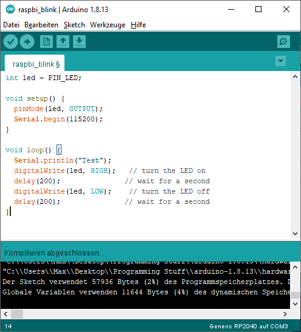

Using this core with PlatformIO
===============================

What is PlatformIO? 
-------------------

`PlatformIO <https://platformio.org/>`__  is a free, open-source build-tool written in Python, which also integrates into VSCode code as an extension.

PlatformIO significantly simplifies writing embedded software by offering a unified build system, yet being able to create project files for many different IDEs, including VSCode, Eclipse, CLion, etc. 
Through this, PlatformIO can offer extensive features such as IntelliSense (autocomplete), debugging, unit testing etc., which not available in the standard Arduino IDE.

The Arduino IDE experience:

The PlatformIO experience:

.. image:: images/the_platformio_experience.png

Refer to the general documentation at https://docs.platformio.org/.

Especially useful is the `Getting started with VSCode + PlatformIO <https://docs.platformio.org/en/latest/integration/ide/vscode.html#installation), [CLI reference](https://docs.platformio.org/en/latest/core/index.html) and [platformio.ini options](https://docs.platformio.org/en/latest/projectconf/index.html)>`__ page.

Hereafter it is assumed that you have a basic understanding of PlatformIO in regards to project creation, project file structure and building and uploading PlatformIO projects, through reading the above pages.

Current state of development
----------------------------

At the time of writing, PlatformIO integration for this core is a work-in-progress and not yet merged into mainline PlatformIO. This is subject to change soon.

If you want to use the PlatformIO integration right now, make sure you first create a standard Raspberry Pi Pico + Arduino project within PlatformIO. 
This will give you a project with the ``platformio.ini`` 

.. code:: ini

    [env:pico]
    platform = raspberrypi
    board = pico
    framework = arduino

Here, you need to change the `platform` to take advantage of the features described hereunder. 
You *also* need to inject two PlatformIO packages, one for the compiler toolchain and one for the Arduino core package.

.. code:: ini

    [env:pico]
    platform = https://github.com/maxgerhardt/platform-raspberrypi.git
    board = pico
    framework = arduino
    ; note that download link for toolchain is specific for OS. see https://github.com/earlephilhower/pico-quick-toolchain/releases.
    platform_packages = 
        maxgerhardt/framework-arduinopico@https://github.com/earlephilhower/arduino-pico.git
        maxgerhardt/toolchain-pico@https://github.com/earlephilhower/pico-quick-toolchain/releases/download/1.3.1-a/x86_64-w64-mingw32.arm-none-eabi-7855b0c.210706.zip
    
When the support for this core has been merged into mainline PlatformIO, this notice will be removed and a standard `platformio.ini` as shown above will work as a base.

Selecting the new core
----------------------

Prerequisite for using this core is to tell PlatformIO to switch to it.
There will be board definition files where the Earle-Philhower core will
be the default since it's a board that only exists in this core (and not
the other https://github.com/arduino/ArduinoCore-mbed). To switch boards
for which this is not the default core (e.g. the standard
``board = pico``), the directive

.. code:: ini

    board_build.core = earlephilhower

must be added to the ``platformio.ini``. This controls the `core
switching
logic <https://github.com/maxgerhardt/platform-raspberrypi/blob/77e0d3a29d1dbf00fd3ec3271104e3bf4820869c/builder/frameworks/arduino/arduino.py#L27-L32>`__.

Flash size
----------

Controlled via specifying the size allocated for the filesystem.
Available sketch size is calculated accordingly by using (as in
``makeboards.py``) that number and the (constant) EEPROM size (4096
bytes) and the total flash size as known to PlatformIO via the board
definition file. The expression on the right can involve "b","k","m"
(bytes/kilobytes/megabytes) and floating point numbers. This makes it
actually more flexible than in the Arduino IDE where there is a finite
list of choices. Calculations happen in `the
platform <https://github.com/maxgerhardt/platform-raspberrypi/blob/77e0d3a29d1dbf00fd3ec3271104e3bf4820869c/builder/main.py#L118-L184>`__.

.. code:: ini

    ; in reference to a board = pico config (2MB flash)
    ; Flash Size: 2MB (Sketch: 1MB, FS:1MB)
    board_build.filesystem_size = 1m
    ; Flash Size: 2MB (No FS)
    board_build.filesystem_size = 0m
    ; Flash Size: 2MB (Sketch: 0.5MB, FS:1.5MB)
    board_build.filesystem_size = 1.5m

CPU Speed
---------

As for all other PlatformIO platforms, the ``f_cpu`` macro value (which
is passed to the core) can be changed as
`documented <https://docs.platformio.org/en/latest/boards/raspberrypi/pico.html#configuration>`__

.. code:: ini

    ; 133MHz
    board_build.f_cpu = 133000000L

Debug Port
----------

Via
`build_flags <https://docs.platformio.org/en/latest/projectconf/section_env_build.html#build-flags>`__
as done for many other cores
(`example <https://docs.platformio.org/en/latest/platforms/ststm32.html#configuration>`__).

.. code:: ini

    ; Debug Port: Serial
    build_flags = -DDEBUG_RP2040_PORT=Serial
    ; Debug Port: Serial 1
    build_flags = -DDEBUG_RP2040_PORT=Serial1
    ; Debug Port: Serial 2
    build_flags = -DDEBUG_RP2040_PORT=Serial2

Debug Level
-----------

Done again by directly adding the needed `build
flags <https://github.com/earlephilhower/arduino-pico/blob/05356da2c5552413a442f742e209c6fa92823666/boards.txt#L104-L114>`__.
When wanting to define multiple build flags, they must be accumulated in
either a sing line or a newline-separated expression.

.. code:: ini

    ; Debug level: Core
    build_flags = -DDEBUG_RP2040_CORE
    ; Debug level: SPI
    build_flags = -DDEBUG_RP2040_SPI
    ; Debug level: Wire
    build_flags = -DDEBUG_RP2040_WIRE
    ; Debug level: All
    build_flags = -DDEBUG_RP2040_WIRE -DDEBUG_RP2040_SPI -DDEBUG_RP2040_CORE
    ; Debug level: NDEBUG
    build_flags = -DNDEBUG

    ; example: Debug port on serial 2 and all debug output
    build_flags = -DDEBUG_RP2040_WIRE -DDEBUG_RP2040_SPI -DDEBUG_RP2040_CORE -DDEBUG_RP2040_PORT=Serial2
    ; equivalent to above
    build_flags = 
       -DDEBUG_RP2040_WIRE
       -DDEBUG_RP2040_SPI
       -DDEBUG_RP2040_CORE
       -DDEBUG_RP2040_PORT=Serial2

USB Stack
---------

Not specifying any special build flags regarding this gives one the
default Pico SDK USB stack. To change it, add

.. code:: ini

    ; Adafruit TinyUSB
    build_flags = -DUSE_TINYUSB
    ; No USB stack
    build_flags = -DPIO_FRAMEWORK_ARDUINO_NO_USB

Note that the special "No USB" setting is also supported, through the
shortcut-define ``PIO_FRAMEWORK_ARDUINO_NO_USB``.

Selecting a different core version
----------------------------------

If you wish to use a different version of the core, e.g., the latest git
``master`` version, you can use a
`platform_packages <https://docs.platformio.org/en/latest/projectconf/section_env_platform.html#platform-packages>`__
directive to do so. Simply specify that the framework package
(``framework-arduinopico``) comes from a different source.

.. code:: ini

    platform_packages =
       framework-arduinopico@https://github.com/earlephilhower/arduino-pico.git#master

Whereas the ``#master`` can also be replaced by a ``#branchname`` or a
``#commithash``. If left out, it will pull the default branch, which is ``master``.

The ``file://`` pseudo-protocol can also be used instead of ``https://`` to point to a
local copy of the core (with e.g. some modifications) on disk.

Note that this can only be done for versions that have the PlatformIO
builder script it in, so versions before 1.9.2 are not supported.

Examples 
--------

The following example ``platformio.ini`` can be used for a Raspberry Pi Pico
and 0.5MByte filesystem. 

.. code:: ini

    [env:pico]
    platform = https://github.com/maxgerhardt/platform-raspberrypi.git
    board = pico
    framework = arduino
    board_build.core = earlephilhower
    board_build.filesystem_size = 0.5m
    ; note that download link for toolchain is specific for OS. see https://github.com/earlephilhower/pico-quick-toolchain/releases.
    platform_packages = 
        maxgerhardt/framework-arduinopico@https://github.com/earlephilhower/arduino-pico.git
        maxgerhardt/toolchain-pico@https://github.com/earlephilhower/pico-quick-toolchain/releases/download/1.3.1-a/x86_64-w64-mingw32.arm-none-eabi-7855b0c.210706.zip

The initial project structure should be generated just creating a new
project for the Pico and the Arduino framework, after which the
auto-generated ``platformio.ini`` can be adapted per above.
